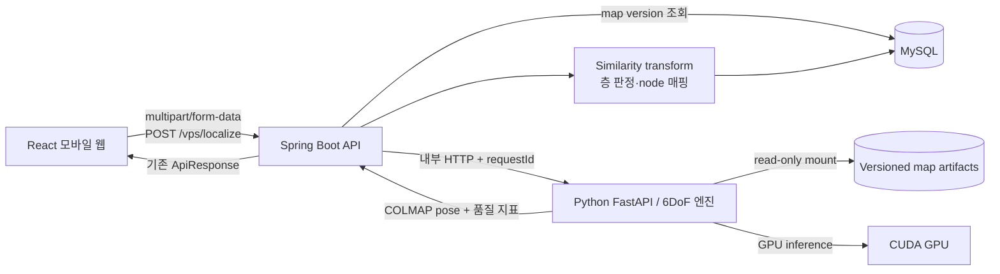
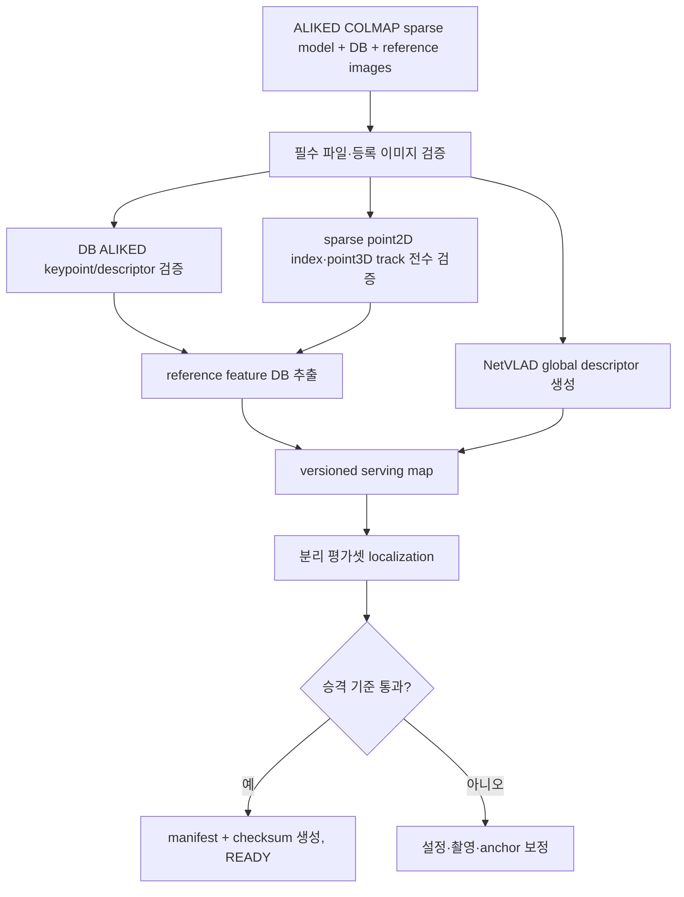
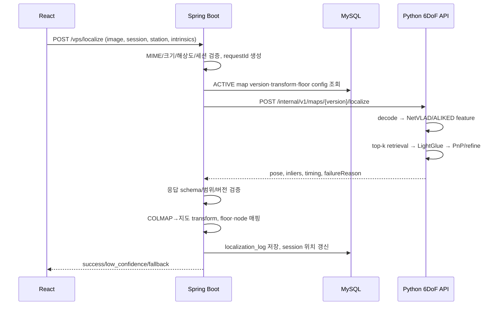

# ALIKED COLMAP 맵 기반 6DoF 위치추정–Spring–Python 연동 설계서

| 항목 | 내용 |
| --- | --- |
| 문서 상태 | 구현 중 — 현재 맵 및 Python 기반 구조 검증 완료 |
| 작성일 | 2026-07-23 |
| 최신화 | 2026-07-23 — ALIKED 맵 검증·anchor/층 판정·FastAPI 구현 현황 반영 |
| 대상 서비스 | PinGo 실내 위치 인식(VPS) |
| 적용 범위 | 기존 COLMAP sparse map을 이용한 단일 이미지 6-DoF 위치추정, Spring API 연동, 운영·배포 |

## 1. 목적

사용자가 모바일 웹에서 촬영한 한 장의 이미지를 기존 COLMAP 3D 맵에 위치시키고, 그 결과를 PinGo의 층·2D 실내 지도·경로 노드로 변환하는 파이프라인을 정의한다.

이 문서는 다음 두 흐름을 함께 다룬다.

1. **오프라인 맵 준비**: 검증된 ALIKED COLMAP 결과를 온라인 추론에 적합한 버전 아티팩트로 패키징한다.
2. **온라인 위치추정**: React → Spring Boot → Python 6DoF 서버 → Spring 좌표 변환·층/node 매핑 → React 흐름으로 위치 후보를 반환한다.

현재 저장소의 공개 API인 `POST /vps/localize`, 응답 목표 5초, 이미지 처리 후 즉시 폐기, 낮은 신뢰도 fallback 정책은 유지한다.

## 2. 범위와 비범위

### 2.1 범위

- COLMAP sparse model과 원본 reference image 검증
- ALIKED reference feature와 NetVLAD global descriptor 구성
- 기존 ALIKED keypoint–3D observation 연결 검증 및 serving artifact 패키징
- 단일 query image의 retrieval → matching → PnP 위치추정
- COLMAP 좌표 → 실내 지도 좌표 → route node 매핑
- Spring 공개 API와 Python 내부 API 계약
- 맵 버전, 장애 격리, 보안, 관측성, 테스트, 배포

### 2.2 비범위

- 연속 영상 SLAM 또는 IMU 센서 융합
- 프론트엔드 화살표의 실시간 drift 보정
- COLMAP 원본 맵 구축·촬영 지침의 상세 절차
- 실내 경로 탐색 알고리즘 자체
- 사용자 촬영 이미지의 장기 보관

## 3. 핵심 설계 결정

| 결정 | 내용 | 이유 |
| --- | --- | --- |
| 서비스 분리 | Spring과 Python 위치추정 서버를 별도 프로세스/컨테이너로 운영 | GPU/PyTorch 의존성과 웹·도메인 로직을 격리 |
| Spring 단일 진입점 | 클라이언트는 Python에 직접 접근하지 않고 Spring의 `/vps/localize`만 호출 | 세션, 입력 검증, 상태 판정, DB 기록, fallback 일원화 |
| 동기 호출 | MVP는 요청 1건에 대해 동기 HTTP 호출 | 기존 API 계약과 5초 UX에 적합; 구현 복잡도 최소화 |
| 원본 맵 불변 | 원본 COLMAP sparse model은 수정하지 않음 | 재현성·롤백 보장 |
| 현재 맵 직접 사용 | 현재 sparse model의 ALIKED keypoint index와 3D observation 연결을 전수 검증한 후 재삼각화 없이 사용 | DB keypoint 좌표·image name·1,505,366개 track observation이 모두 일치 |
| 좌표 책임 분리 | Python은 COLMAP pose와 품질 지표, Spring은 지도 좌표·route node를 확정 | 기존 백엔드 도메인 책임 및 DB 데이터와 일치 |
| 무상태 추론 | 요청 아티팩트는 request workspace에만 저장하고 응답 후 삭제 | 확장·개인정보 보호·장애 복구 단순화 |
| 버전 고정 | 요청마다 활성 `mapVersion`을 확정하고 추론 중 변경하지 않음 | 결과와 로그 재현성 확보 |

온라인 파이프라인은 local feature 추출, reference SfM, query retrieval,
query–database matching, pose localization 순서로 구성한다. correspondence와
pose adapter는 hloc의 검증된 흐름을 참고하되 현재 reference feature 형식과
서버 생명주기에 맞게 분리 구현한다.

### 3.1 현재 구현 상태

2026-07-23 기준 Python AI 서버 구현 완료 범위:

- ALIKED N16Rot Query feature extractor와 입출력 shape 검증
- FastAPI application factory
- `GET /health/live`, `GET /health/ready`
- thread-safe engine/map readiness 상태
- `pycolmap==3.13.0` 기반 sparse model loader
- mapVersion별 read-only `MapContext`
- image name–COLMAP image ID index
- FastAPI lifespan map preload
- 맵 미설정 `MAP_NOT_CONFIGURED`, 로딩 실패 `MAP_LOAD_FAILED` readiness
- 실제 sparse map 통합 테스트: 카메라 1개, 등록 이미지 766장, 3D point 203,384개

아직 구현되지 않은 범위:

- ALIKED·NetVLAD·LightGlue 전체 warm engine와 engine readiness
- Spring → Python localize endpoint와 multipart/camera schema
- retrieval, matching, 2D–3D correspondence, PnP, 품질 판정
- GPU semaphore와 bounded queue
- 내부 token, request ID, 임시 데이터 정리, metrics
- Spring anchor transform·floor·route node 연동

## 4. 전체 아키텍처



### 4.1 컴포넌트 책임

| 컴포넌트 | 책임 |
| --- | --- |
| React | 카메라 프레임 선택, JPEG 압축, 촬영 메타데이터 전달, 결과/fallback 표시 |
| Spring `localization` 도메인 | 세션·역·맵 버전 검증, 업로드 제한, Python 호출, 응답 검증, 상태 판정, 좌표 앵커링 호출, 로그, fallback |
| Python 6DoF API | 이미지 디코딩, query feature/retrieval/matching/PnP, pose·품질 지표 반환, 임시 파일 삭제 |
| Map build job | COLMAP 입력 검증, serving reference artifact 생성, 평가, manifest/checksum 생성 |
| MySQL | 활성 맵 버전, anchor transform, 층 영역, route node, 위치추정 결과 로그 |
| Artifact storage | 버전별 불변 serving 아티팩트 저장; Python에 read-only 제공 |

## 5. 오프라인 맵 준비 파이프라인

### 5.1 입력 조건

맵 버전 하나의 입력은 다음과 같다.

```text
map-source/{stationKey}/{sourceVersion}/
├─ images/                 # COLMAP IMAGE.NAME과 상대 경로가 같은 원본 이미지
├─ sparse/0/
│  ├─ cameras.bin|txt
│  ├─ images.bin|txt
│  └─ points3D.bin|txt
├─ anchors.json            # COLMAP→지도 좌표 기준점
├─ floor-regions.json      # 층별 영역 또는 z 범위
└─ evaluation/
   ├─ images/              # 맵 구축에 사용하지 않은 평가 이미지
   └─ ground-truth.json
```

필수 검증은 다음과 같다.

- `pycolmap.Reconstruction`으로 sparse model을 정상 로드할 수 있어야 한다.
- 등록 이미지의 `image.name`에 대응하는 원본 이미지가 모두 존재해야 한다.
- 카메라 모델과 이미지 크기가 유효해야 한다.
- 평가 이미지는 reference reconstruction에 포함하지 않는다.
- 맵에 여러 disconnected component가 있으면 운영 대상 component를 명시한다.
- 최소 3개 이상의 비공선 anchor를 권장하며, residual 허용 범위를 평가한다.

COLMAP의 image pose는 **world → camera** 변환이다. camera center는 `C = -Rᵀt`로 계산해야 한다. 좌표계 정의는 [COLMAP output format 공식 문서](https://colmap.github.io/format.html)를 따른다.

### 5.2 현재 feature 구성

현재 reference map과 Query가 공유해야 하는 고정 구성은 다음과 같다.
threshold와 retrieval top-k는 평가셋으로 조정하되 feature 종류, descriptor 형식,
local feature resize는 mapVersion을 변경하지 않고 바꾸지 않는다.

| 단계 | 초기값 | 비고 |
| --- | --- | --- |
| Global retrieval | NetVLAD, top-k 20 | 구역별 시각 반복이 많으면 30까지 평가 |
| Local feature | ALIKED N16Rot, 최대 4,096 keypoints, `resize=None` | 원본 해상도 기준, 128차원 float32 descriptor |
| Matcher | LightGlue(ALIKED) | GPU 사용, warm loading |
| Pose | pycolmap 3.13 absolute pose estimation + refinement | RANSAC max error 초기 8~12 px 평가 |
| Covisibility | 사용 | retrieval 결과를 연결 component별 검증 가능 |

현재 기준 이미지 호환성 probe에서 원본 해상도 ALIKED N16Rot Query와 reference
descriptor의 1px 이내 대응점 cosine similarity 중앙값은 0.9558이었다. 임의
resize 또는 SuperPoint Query descriptor를 현재 map과 혼합하지 않는다.

### 5.3 현재 COLMAP 맵을 서빙용 맵으로 패키징



현재 산출물 검증 결과:

- stage metadata: `ALIKED_N16ROT`, `ALIKED_LIGHTGLUE`, 최대 feature 4,096개
- DB/reference/registered image: 각각 766장
- 3D point: 203,384개
- point3D track observation: 1,505,366개
- image name mismatch, keypoint 좌표 mismatch, point2D index 오류, track 역참조 오류: 모두 0건

따라서 현재 맵은 별도 재삼각화 없이 serving reference model로 직접 사용한다.
향후 SIFT 또는 다른 local feature로 구축된 맵을 도입할 때는 feature index를
단순 연결하지 않고 별도 호환성 검증 또는 재삼각화를 수행한다.

### 5.4 산출물 구조

```text
map-artifacts/{stationId}/{mapVersion}/
├─ manifest.json
├─ reference_sfm/
│  ├─ cameras.bin
│  ├─ images.bin
│  └─ points3D.bin
├─ reference_features.db
├─ global_descriptors.h5
├─ quality-report.json
└─ checksums.sha256
```

`anchors.json`과 `floor-regions.json`은 오프라인 calibration 입력으로 보관할 수
있지만, 온라인 Spring 처리에서는 같은 mapVersion에 연결된 검증 완료 transform과
floor 설정을 MySQL에서 조회한다. Python runtime map에는 Spring 도메인 좌표와
route node가 필요하지 않다.

`manifest.json` 예시는 다음과 같다.

```json
{
  "schemaVersion": 1,
  "stationId": 1,
  "mapVersion": "YS-2026-07-23.1",
  "sourceColmapVersion": "colmap-3.13",
  "lightglueCommit": "eb42fee2d71449efb0aa5c10549752b5d75384d8",
  "pycolmapVersion": "3.13.0",
  "retrieval": {"name": "netvlad", "topK": 20},
  "localFeature": {
    "name": "aliked-n16rot",
    "maxKeypoints": 4096,
    "resize": null,
    "descriptorDimension": 128,
    "descriptorStorage": "FLOAT32"
  },
  "matcher": {"name": "lightglue", "features": "aliked"},
  "pose": {"ransacMaxErrorPx": 10.0},
  "coordinateFrame": "COLMAP_WORLD",
  "builtAt": "2026-07-23T09:00:00Z"
}
```

LightGlue, pycolmap, PyTorch/CUDA 조합은 floating tag 대신 검증된
commit·정확한 dependency lock·container digest로 고정한다. 현재 Python
프로젝트는 `pycolmap==3.13.0`과 특정 LightGlue commit을 사용한다.

### 5.5 맵 승격 상태

```text
BUILDING → VALIDATING → READY → ACTIVE → RETIRED
                └─────→ FAILED
```

- `ACTIVE`는 station당 하나만 허용한다.
- 활성화는 DB transaction으로 기존 ACTIVE를 RETIRED하고 새 버전을 ACTIVE로 변경한다.
- Python 서버가 새 버전을 preload하고 health check를 통과한 뒤 DB 활성화를 수행한다.
- 진행 중 요청은 요청 시작 시 고정한 map version으로 끝까지 처리한다.
- 이상 발생 시 이전 artifact와 DB version으로 즉시 rollback한다.

## 6. 온라인 위치추정 파이프라인

### 6.1 요청 시퀀스



### 6.2 Python 내부 처리

1. 요청별 mutable state를 생성한다. 임시 파일이 필요할 때만 `requestId` 기준
   작업 공간을 사용한다. 예: `/dev/shm/ai-query/{requestId}`.
2. JPEG/PNG magic bytes로 실제 형식을 검사하고 OpenCV/Pillow로 decode한다.
3. EXIF orientation을 적용하고 최대 파일 크기와 pixel 수를 검사한다.
4. NetVLAD용 입력 resize와 ALIKED local feature 전처리를 분리한다. ALIKED는
   reference 호환성을 위해 원본 해상도(`resize=None`)를 사용한다.
5. query global descriptor와 ALIKED local feature를 추출한다.
6. reference global descriptor에서 top-k 후보를 검색한다.
7. query와 후보 reference image를 ALIKED LightGlue로 matching한다.
8. reference model의 3D observation으로 2D–3D correspondence를 만들고 absolute pose를 추정·refine한다.
9. camera center, orientation, inlier 수·비율, retrieval/matching 품질, 단계별 시간을 계산한다.
10. 임시 이미지와 query feature를 `finally` 블록에서 삭제한다.

hloc의 `localize_sfm`은 query–DB match를 3D point observation에 연결한 뒤 `pycolmap.estimate_and_refine_absolute_pose`를 호출한다. 세부 동작은 [공식 `localize_sfm.py`](https://github.com/cvg/Hierarchical-Localization/blob/master/hloc/localize_sfm.py)를 기준으로 adapter를 작성한다.

공식 batch script에는 pose 추정 실패 시 첫 retrieval image의 pose를 결과 파일에 기록하는 fallback 경로가 있다. API adapter에서는 이를 성공 결과로 사용하지 않는다. `estimate_and_refine_absolute_pose`의 반환값과 inlier 조건을 직접 검사하고 실패 시 반드시 `POSE_ESTIMATION_FAILED`를 반환한다. 검색상 가장 비슷한 사진의 위치는 사용자 위치의 증거가 아니다.

### 6.3 모델 warm loading

요청마다 ALIKED, NetVLAD, LightGlue와 reconstruction을 다시 로드하면 5초
목표를 맞추기 어렵다. Python process 시작 시 다음을 preload한다.

- ALIKED N16Rot·NetVLAD·LightGlue GPU weight
- 활성 map의 `pycolmap.Reconstruction`
- reference local/global descriptors 또는 retrieval index
- image name ↔ reconstruction image ID index

맵은 `mapVersion` key의 read-only `MapContext`로 관리한다. MVP의 단일 활성
맵은 `AI_MAP_VERSION`, `AI_MAP_MODEL_PATH` 설정으로 FastAPI lifespan에서
사전 로딩한다. 새 맵 활성화 기능을 구현할 때는 별도 context를 load한 뒤
atomic pointer를 교체하고, 사용 중인 이전 context는 in-flight request가
0이 된 후 해제한다.

FastAPI lifespan 준비 순서:

```text
설정 확인
→ pycolmap.Reconstruction 로딩
→ image name–image ID index 생성
→ map readiness READY
→ GPU 모델 로딩 및 warm-up
→ engine readiness READY
```

`/health/ready`는 map과 engine이 모두 `READY`일 때만 HTTP 200을 반환한다.
맵 설정 누락은 `MAP_NOT_CONFIGURED`, 로딩 실패는 `MAP_LOAD_FAILED`로 표시한다.

### 6.4 카메라 내부 파라미터

정확한 PnP를 위해 프론트엔드는 가능한 경우 다음 메타데이터를 전달한다.

```json
{
  "cameraModel": "PINHOLE",
  "width": 1280,
  "height": 720,
  "params": [1050.2, 1048.8, 640.0, 360.0],
  "headingDeg": 127.4,
  "capturedAt": "2026-07-23T08:10:11.123Z"
}
```

- 웹 카메라 API만으로 정확한 calibration을 얻지 못하면 기기군별 사전 calibration을 사용한다.
- calibration을 찾지 못하면 `SIMPLE_PINHOLE` 근삿값을 사용하되 `intrinsicsSource=ESTIMATED`를 반환하고 신뢰도를 한 단계 낮춘다.
- NetVLAD 등 resize가 필요한 단계에서만 focal length와 principal point를 동일
  비율로 조정한다. ALIKED local feature는 원본 해상도를 유지한다.
- EXIF/화면 rotation 적용 후 width/height 및 principal point를 일관되게 변환한다.

## 7. API 설계

### 7.1 외부 API: 기존 계약 확장

`POST /vps/localize`, `multipart/form-data`

| part | 필수 | 설명 |
| --- | --- | --- |
| `userSessionId` | Y | 비로그인 사용자 세션 |
| `stationId` | Y | 사용자가 선택한 역 |
| `image` | Y | JPEG/PNG, 권장 JPEG |
| `heading` | N | 단말 방위각; 기존 호환 필드 |
| `cameraMetadata` | N | JSON part, intrinsics·촬영 시각·기기군 |

기존 성공 응답 형태는 유지하되 추적용 `requestId`를 추가한다.

```json
{
  "success": true,
  "data": {
    "requestId": "loc_01J...",
    "resultStatus": "success",
    "mapVersion": "YS-2026-07-23.1",
    "candidates": [
      {
        "nodeId": 15,
        "floorId": 2,
        "label": "B2 개찰구 앞",
        "mapX": 320.5,
        "mapY": 180.2,
        "heading": 126.8,
        "confidenceScore": 0.87,
        "confidenceLabel": "high"
      }
    ],
    "processingTimeMs": 2310
  },
  "message": null
}
```

### 7.2 Spring → Python 내부 API

`POST /internal/v1/maps/{mapVersion}/localize`, `multipart/form-data`

Header:

```text
X-Request-Id: loc_01J...
X-Internal-Token: <secret>      # 서비스 메시 또는 mTLS 적용 전 MVP
```

Part:

- `image`: 원본 byte stream
- `metadata`: JSON

```json
{
  "stationId": 1,
  "camera": {
    "model": "PINHOLE",
    "width": 1280,
    "height": 720,
    "params": [1050.2, 1048.8, 640.0, 360.0],
    "intrinsicsSource": "DEVICE_PROFILE"
  },
  "capturedAt": "2026-07-23T08:10:11.123Z"
}
```

Python 성공 응답은 서비스 도메인 node가 아니라 기하 결과를 반환한다.

```json
{
  "requestId": "loc_01J...",
  "status": "LOCALIZED",
  "mapVersion": "YS-2026-07-23.1",
  "pose": {
    "convention": "CAM_FROM_COLMAP_WORLD",
    "qvecWxyz": [0.99, 0.01, 0.03, -0.02],
    "tvec": [1.12, -0.41, 2.87],
    "cameraCenter": [2.31, 0.82, -1.44]
  },
  "quality": {
    "numMatches": 184,
    "numCorrespondences": 92,
    "numInliers": 61,
    "inlierRatio": 0.663,
    "medianReprojectionErrorPx": 2.1,
    "retrievedImages": 20,
    "supportingImages": 5,
    "intrinsicsSource": "DEVICE_PROFILE"
  },
  "timingMs": {
    "decode": 18,
    "globalFeature": 110,
    "retrieval": 8,
    "localFeature": 125,
    "matching": 930,
    "pose": 75,
    "total": 1266
  }
}
```

Python 실패 상태:

| status | HTTP | 의미 | Spring 처리 |
| --- | ---: | --- | --- |
| `INVALID_IMAGE` | 400/422 | decode, 크기, 카메라 정보 오류 | `invalid_image`, 재촬영 안내 |
| `MAP_NOT_LOADED` | 404/503 | 버전 없음 또는 load 실패 | `ai_unavailable`, fallback |
| `NO_RETRIEVAL_CANDIDATE` | 200 | 검색 후보 없음 | `low_confidence` |
| `INSUFFICIENT_MATCHES` | 200 | matching/2D–3D 대응 부족 | `low_confidence` |
| `POSE_ESTIMATION_FAILED` | 200 | PnP/RANSAC 실패 | `low_confidence` |
| `OVERLOADED` | 429 | GPU queue 포화 | 즉시 fallback, retry 금지 |
| `INTERNAL_ERROR` | 500 | 예기치 않은 추론 오류 | circuit breaker 집계, fallback |

기하학적 “찾지 못함”은 정상적인 추론 결과이므로 HTTP 200으로 반환하고, 시스템 장애와 구분한다.

### 7.3 Health API

| API | 목적 |
| --- | --- |
| `GET /health/live` | HTTP process 생존 여부 |
| `GET /health/ready` | engine과 활성 map이 모두 READY인지 확인 |
| `GET /internal/v1/maps` | 향후 load된 map version과 상태 조회; 내부망 전용 |
| `POST /internal/v1/maps/{version}/preload` | 향후 새 artifact load 및 checksum 검증; 관리자/배포 작업 전용 |

## 8. 좌표 변환과 route node 매핑

### 8.1 COLMAP pose 해석

Python이 반환한 `R, t`가 world → camera일 때:

```text
C_colmap = -Rᵀ t
forward_colmap = Rᵀ [0, 0, 1]ᵀ
```

`t` 자체를 사용자 위치로 사용하면 안 된다.

### 8.2 Similarity transform

여기서 anchor는 사용자 이미지에서 탐지하는 마커나 객체가 아니다. 맵 구축·정합
단계에서 동일한 실제 지점을 COLMAP 좌표와 실내 지도 좌표로 각각 측정한
**사전 등록 control point**다.

예:

```text
anchor A: COLMAP (1.2, 0.5, -0.3) ↔ 지도 (320.0, 180.0, B2)
anchor B: COLMAP (5.7, 0.4, -0.2) ↔ 지도 (410.0, 181.0, B2)
anchor C: COLMAP (2.0, 3.1,  2.8) ↔ 지도 (330.0,  90.0, B1)
```

최소 3개 이상의 비공선 anchor로 mapVersion별 similarity transform을 오프라인에서
계산·검증하고 MySQL의 `vps_map_transform`에 저장한다. 온라인 요청에서 Spring이
“anchor를 조회한다”는 것은 사용자 이미지에서 anchor를 찾거나 transform을 매번
다시 fitting한다는 뜻이 아니라, 활성 mapVersion에 이미 연결된 검증 완료
`scale`, `rotation`, `translation`을 읽는다는 뜻이다.

COLMAP은 절대 scale과 실내 지도 원점을 알지 못하므로 다음 변환을 사용한다.

```text
p_map3d = s · R_anchor · p_colmap + t_anchor
```

- `s`: COLMAP unit → meter 또는 지도 단위 scale
- `R_anchor`: 두 좌표계 축 정렬
- `t_anchor`: 지도 원점 이동
- 2D 지도 좌표가 pixel이면 meter 좌표를 `scale_m_per_px`와 map origin으로 추가 변환한다.
- transform은 map version에 종속되며 새 reconstruction에 재사용하지 않는다.
- anchor fit RMS/p95 residual을 `quality-report.json`에 기록한다.
- Python은 anchor와 Spring 지도 좌표를 알지 않으며 COLMAP pose만 반환한다.
- Spring은 Python이 반환한 Query `cameraCenter`에 transform을 적용한다.

방향은 `forward_colmap`에 `R_anchor`를 적용한 뒤 지도 평면에 투영해 계산한다. 단말 `heading`은 독립적인 품질 보조값이며 좌표계 정렬 없이 pose yaw와 직접 평균하지 않는다.

### 8.3 층과 node 매핑

층을 사용자 이미지 한 장에서 직접 분류하지 않는다. Python이 추정한 3D 위치를
지도 좌표로 변환한 뒤 mapVersion과 층 영역을 이용해 판정한다.

1. mapVersion이 특정 층 전용이면 연결된 `floorId`를 1차 층 후보로 사용한다.
2. 변환된 3D 좌표가 해당 층의 polygon/z-band와 유효 보행 영역에 포함되는지 검증한다.
3. 여러 층을 포함한 map이면 변환된 높이와 층별 3D 영역으로 후보를 결정한다.
4. 해당 층의 활성 route node만 후보로 제한한다.
5. 공간 인덱스로 최근접 node를 찾는다.
6. node까지의 수평 거리와 보행 가능 영역 포함 여부를 검사한다.
7. 임계 거리 밖이면 `LOCATION_NOT_MAPPED`로 처리하며 AI confidence와 별도로 실패시킨다.

엘리베이터/계단처럼 다른 층의 좌표가 수직으로 겹치는 지점은 2D 최근접만으로 층을 정하지 않는다. 층 판정 결과와 연결 그래프를 함께 사용한다.

현재 reference 이미지가 `B2/...`로 구성된 B2 전용 맵이라면 mapVersion에 B2
`floorId`를 연결하고, 온라인에서는 transform 결과가 B2 유효 영역 안에 있는지
검증하는 방식을 우선 사용한다.

## 9. 신뢰도와 상태 판정

`confidenceScore`는 Python 위치추정 엔진이 직접 제공하는 확률값이 아니다.
다음 관측값을 평가셋으로 calibration한 서비스 지표다.

- `numInliers`, `inlierRatio`
- median/p95 reprojection error
- 서로 다른 supporting reference image 수
- retrieval similarity gap
- intrinsics source
- anchor residual과 최근접 node 거리

초기 판정값은 구현 시작점일 뿐이며 현장 평가 후 조정한다.

| 결과 | 초기 조건 예시 |
| --- | --- |
| `SUCCESS/HIGH` | inlier ≥ 40, ratio ≥ 0.35, median error ≤ 4 px, supporting image ≥ 2, node mapping 정상 |
| `SUCCESS/MEDIUM` | inlier ≥ 25, ratio ≥ 0.20, median error ≤ 8 px, node mapping 정상 |
| `LOW_CONFIDENCE` | pose는 있으나 위 기준 미달 또는 estimated intrinsics로 경계값 |
| `LOCATION_NOT_MAPPED` | pose 품질은 정상이나 map/층/node 유효성 실패 |
| `AI_TIMEOUT/UNAVAILABLE` | 시스템 실패 |

평가셋에서 성공/실패 threshold를 선택하고 `mapVersion + modelConfigVersion`별로 저장한다. 같은 점수를 서로 다른 맵 버전에서 동일한 확률로 해석하지 않는다.

## 10. Spring 구현 설계

### 10.1 권장 패키지

```text
backend/src/main/java/com/pingo/backend/localization/
├─ controller/VpsLocalizationController.java
├─ service/LocalizationService.java
├─ client/AiLocalizationClient.java
├─ client/dto/AiLocalizationRequestMetadata.java
├─ client/dto/AiLocalizationResponse.java
├─ domain/LocalizationStatus.java
├─ domain/ConfidencePolicy.java
├─ mapping/CoordinateAnchorService.java
├─ mapping/RouteNodeSnapService.java
├─ repository/LocalizationLogRepository.java
└─ dto/
```

### 10.2 처리 순서

1. `MultipartFile`의 declared MIME만 믿지 않고 magic bytes, 최대 크기, pixel 수를 검증한다.
2. `userSessionId`, `stationId`, session 만료 및 선택 역 일치 여부를 검사한다.
3. ULID/UUID `requestId`를 생성해 모든 로그와 내부 요청에 전달한다.
4. station의 ACTIVE mapVersion, 연결된 floorId, 오프라인에서 계산 완료된
   similarity transform을 조회한다. 사용자 이미지에서 anchor를 탐지하지 않는다.
5. Python을 1회 호출한다. timeout/429/5xx에 자동 retry하지 않는다.
6. Python 응답의 request ID, map version, quaternion norm, 유한 숫자, metric 범위를 검사한다.
7. 성공 pose에 대해서만 anchor·floor·node mapping을 수행한다.
8. 서비스 상태와 fallback을 결정하고 `localization_log`를 기록한다.
9. 성공 시 `user_session.current_node_id`를 갱신한다.

Spring MVC를 유지하기 위해 동기 client를 사용해도 되지만, Tomcat request
thread와 Python GPU queue 용량을 함께 제한한다. 사용자마다 영구 thread를
할당하는 것이 아니라 Tomcat thread pool의 thread가 요청 동안 사용되고
재사용된다. bulkhead가 가득 차면 대기시키지 않고 fallback 응답을 반환한다.

### 10.3 timeout·circuit breaker

| 항목 | 초기값 |
| --- | ---: |
| Spring → Python connect timeout | 300 ms |
| Python response timeout | 6,000 ms |
| 전체 공개 API hard timeout | 7,000 ms |
| GPU 동시 실행 | GPU당 1건부터 측정 |
| Python 대기 queue | GPU당 2건 이하 |
| retry | 0회 |
| circuit open 기준 | 최근 window에서 timeout/5xx 비율 기반, 현장 부하 시험 후 확정 |

목표는 전체 p95 5초 이내이며 hard timeout은 목표가 아니라 안전장치다. circuit open, timeout, overload 때는 HTTP 5xx 대신 기존 `fallbackOptions`가 포함된 정상 응답으로 사용자 흐름을 유지한다.

## 11. Python 서버 설계

### 11.1 권장 모듈

```text
ai/
├─ app/
│  ├─ main.py
│  ├─ api/localization.py
│  ├─ api/health.py
│  ├─ core/config.py
│  ├─ core/readiness.py
│  ├─ core/security.py
│  ├─ engine/localization_engine.py
│  ├─ engine/feature_extractor.py
│  ├─ engine/quality.py
│  ├─ maps/map_context.py
│  ├─ maps/map_loader.py
│  ├─ maps/map_registry.py
│  ├─ schemas/request.py
│  ├─ schemas/response.py
│  └─ observability/metrics.py
├─ tools/
├─ tests/
├─ pyproject.toml
└─ Dockerfile
```

### 11.2 동시성

- GPU 하나에 Uvicorn worker를 여러 개 띄우면 각 process가 model weight를 복제하므로 기본은 worker 1개다.
- bounded `asyncio.Semaphore` 또는 전용 inference queue로 GPU 동시 실행을 제한한다.
- FastAPI의 async event loop는 네트워크와 대기 상태를 처리하고, pycolmap·PyTorch
  동기 파이프라인은 명시적인 executor 또는 `run_in_threadpool`에서 실행한다.
- `ReadinessState`의 `Lock`은 여러 요청·lifespan이 공유하는 engine/map 상태의
  짧은 읽기·쓰기를 보호한다. 사용자별 추론 동시성을 제어하는 lock이 아니다.
- GPU 추론 동시성은 별도 semaphore, 대기량은 bounded queue로 제어한다.
- 파일명/HDF5 key는 반드시 `requestId` namespace로 격리한다.
- 공용 HDF5에 query feature를 append하지 않는다. h5py 동시 쓰기와 stale data 충돌을 피한다.
- reference artifact는 read-only로 공유하고 query artifact는 요청별로 생성한다.
- CUDA OOM 발생 시 cache 정리보다 먼저 요청을 실패시키고 readiness를 낮춘다. 반복 OOM은 process 재시작 대상으로 본다.

### 11.3 단계적 구현

1. **Map baseline**: pycolmap으로 현재 ALIKED sparse map과 image index를 검증한다.
2. **Warm engine**: ALIKED/NetVLAD/LightGlue를 singleton으로 유지하고 query tensor를 직접 처리한다.
3. **Index 최적화**: reference global descriptor 검색을 FAISS/행렬 연산 index로 preload한다.
4. **Batch/영상 확장**: MVP 이후에만 짧은 burst frame과 temporal filtering을 검토한다.

## 12. 데이터 모델 변경 제안

기존 `vps_map`, `localization_log`를 유지하면서 다음 필드를 추가한다.

### 12.1 `vps_map`

| 필드 | 타입 예시 | 설명 |
| --- | --- | --- |
| `artifact_uri` | varchar(500) | version root URI/path |
| `artifact_checksum` | char(64) | manifest 또는 bundle SHA-256 |
| `config_json` | json | feature/matcher/pose 설정 |
| `activated_at` | datetime(6) | 활성 시각 |
| `retired_at` | datetime(6) | 비활성 시각 |

### 12.2 `vps_map_transform` 신규

| 필드 | 설명 |
| --- | --- |
| `transform_id` | PK |
| `vps_map_id` | FK, map version 종속 |
| `scale` | similarity scale |
| `rotation_json` | 3×3 matrix 또는 정규화 quaternion |
| `translation_json` | 3-vector |
| `rms_error_m`, `p95_error_m` | anchor fit 품질 |
| `anchor_count` | 사용 anchor 수 |

### 12.3 `localization_log` 확장

| 필드 | 설명 |
| --- | --- |
| `request_id` | 전체 추적 ID, unique 권장 |
| `vps_map_id` | 실제 사용 맵 |
| `failure_reason` | 세분화된 실패 코드 |
| `inlier_count`, `inlier_ratio` | pose 품질 |
| `reprojection_error_px` | pose 품질 |
| `node_distance_m` | mapping 품질 |
| `processing_time_ms`, `ai_time_ms` | 성능 |
| `intrinsics_source` | calibration 품질 분석 |

원본 이미지, descriptor, keypoint, 상세 매칭 데이터는 기본 DB 로그에 저장하지 않는다.

## 13. 보안·개인정보

- Python API는 외부에 publish하지 않고 Docker/internal network 또는 private subnet에서만 노출한다.
- Spring–Python 사이에 내부 token을 적용하고 운영에서는 mTLS/service mesh를 우선 검토한다.
- 업로드 최대 크기, 최대 pixel 수, decode timeout을 제한해 decompression bomb를 방지한다.
- 허용 형식은 JPEG/PNG로 제한하며 파일 확장자를 신뢰하지 않는다.
- 사용자 이미지는 추론 완료/실패 직후 삭제한다. access log에 multipart body나 경로를 남기지 않는다.
- 장애 분석용 이미지 수집이 필요하면 별도 명시적 동의, 보존 기간, 암호화, 접근 권한을 설계한 뒤 opt-in으로만 수행한다.
- artifact는 checksum과 read-only mount로 무결성을 확인한다.
- 내부 오류 응답에 filesystem path, stack trace, reference image name 전체를 노출하지 않는다.

## 14. 관측성

### 14.1 공통 로그 필드

```text
requestId, userSessionHash, stationId, mapVersion,
resultStatus, failureReason, totalMs, aiMs,
inliers, inlierRatio, reprojectionErrorPx, nodeDistanceM
```

`userSessionId` 원문은 애플리케이션 로그에 남기지 않고 hash/부분 마스킹한다.

### 14.2 Metrics

- `localization_requests_total{status,station,map_version}`
- `localization_duration_seconds{stage}` histogram
- `ai_localization_inliers`, `ai_localization_inlier_ratio`, `ai_localization_reprojection_error_px`
- `localization_node_distance_m`
- `ai_localization_gpu_queue_depth`, `ai_localization_gpu_memory_bytes`
- `ai_localization_map_loaded{map_version}`
- `localization_fallback_total{reason}`

### 14.3 Alert

- 5분 success rate 급락
- p95 5초 초과
- timeout/5xx/429 비율 임계 초과
- readiness 실패 또는 활성 map 미로드
- CUDA OOM 반복
- 특정 map version의 `LOCATION_NOT_MAPPED` 급증

## 15. 배포 설계

### 15.1 컨테이너 구성

```text
nginx
  └─ spring-backend:8080
       ├─ mysql:3306
       └─ ai-localization:8000 (internal only)
            ├─ NVIDIA runtime / CUDA
            └─ /maps:ro
```

- Spring과 Python 이미지는 독립적으로 build/versioning한다.
- AI localization image는 CUDA/PyTorch/pycolmap 호환 조합을 digest로 고정한다.
- `latest` tag를 운영에 사용하지 않는다.
- map artifact는 image에 포함하지 않고 versioned volume/object storage cache로 제공한다.
- GPU가 없는 개발 환경은 mock adapter 또는 작은 reference map을 사용하는 CPU
  profile로 API 계약을 검증한다. 운영 map의 feature 종류는 바꾸지 않는다.

### 15.2 환경 변수

Spring:

```text
AI_LOCALIZATION_BASE_URL=http://ai-localization:8000
AI_LOCALIZATION_INTERNAL_TOKEN=<secret>
AI_LOCALIZATION_CONNECT_TIMEOUT_MS=300
AI_LOCALIZATION_READ_TIMEOUT_MS=6000
LOCALIZATION_MAX_IMAGE_BYTES=8388608
LOCALIZATION_MAX_PIXELS=12000000
```

Python:

```text
AI_MAP_VERSION=YS-2026-07-23.1
AI_MAP_MODEL_PATH=/maps/YS-2026-07-23.1/reference_sfm
AI_DEVICE=cuda
AI_INTERNAL_TOKEN=<same-secret>
AI_MAX_QUEUE_SIZE=2
AI_REQUEST_WORK_ROOT=/dev/shm/ai-query
AI_LOG_LEVEL=INFO
```

## 16. 테스트 전략

### 16.1 맵 빌드 테스트

- 원본 이미지 누락, 손상 sparse model, 잘못된 camera ID 거부
- serving model의 등록 이미지·3D point 수 최소 기준
- artifact checksum 재검증
- anchor transform residual 기준
- 동일 입력과 고정 dependency에서의 재현성

### 16.2 Python 단위·통합 테스트

- orientation/resize 후 intrinsics 변환
- ALIKED Query descriptor 128차원과 reference 호환성
- 필수 sparse 파일, 빈 reconstruction, image index 불변성
- 실제 ALIKED sparse map 로딩
- lifespan map preload 성공·미설정·실패 readiness
- world-to-camera에서 camera center 계산
- retrieval 후보 없음, match 부족, PnP 실패 상태 구분
- request workspace 충돌·정리
- 동일/동시 요청 격리
- map preload와 atomic switch
- 실제 평가 이미지 golden test

### 16.3 Spring 테스트

- multipart 크기·MIME·pixel 검증
- 세션/역/활성 map 불일치
- Python timeout, 429, 5xx, 잘못된 JSON, map version mismatch
- quaternion/NaN/범위 검증
- similarity transform과 층/node 매핑
- low confidence/fallback 계약
- 이미지 byte 또는 민감정보가 로그에 남지 않는지 확인

### 16.4 End-to-end·성능 테스트

| 항목 | MVP 완료 기준 제안 |
| --- | --- |
| 평가 데이터 분리 | reference에 포함되지 않은 동선·조명·시점 이미지 사용 |
| 위치 성공률 | 주요 시연 지점별 목표를 별도 확정하고 report에 명시 |
| 위치 오차 | median/p95를 meter 단위로 측정 |
| 층 정확도 | 층 오판을 별도 지표로 측정 |
| node 매핑 | 올바른 route node 또는 허용 반경 내 node 비율 |
| 성능 | 공개 API p95 ≤ 5초, timeout fallback 정상 |
| 부하 | 목표 동시 사용자에서 queue와 429 비율 확인 |
| 복구 | Python 중단, GPU OOM, 잘못된 맵 활성화 시 fallback/rollback 확인 |

평가 이미지는 COLMAP 맵 구축 이미지와 반드시 분리한다. reference image로 성공률을 측정하면 실제 일반화 성능을 과대평가한다.

## 17. 구현 단계와 작업 분할

### Phase 0. 입력·기준 확정

- [x] B2 COLMAP artifact 확보
- [x] image name, camera model, sparse component 검증
- [x] ALIKED N16Rot·LightGlue feature 구성 확정
- anchor·floor·route node 좌표 기준 확정
- 평가셋 및 위치 ground truth 분리

### Phase 1. 오프라인 ALIKED baseline

- [x] 현재 ALIKED keypoint–3D observation 직접 호환성 확인
- reference NetVLAD global descriptor와 serving bundle 생성
- evaluation script와 quality report 생성
- 좌표 변환·node mapping 검증
- top-k/RANSAC·품질 threshold 평가

### Phase 2. Python API

- [x] FastAPI application factory와 health API
- [x] sparse map loader, `MapContext`, lifespan map preload
- warm engine와 bounded queue
- 내부 localize API와 pose pipeline
- 요청별 workspace와 삭제 보장
- metrics·structured logging

### Phase 3. Spring 연동

- `localization` package와 AI localization client
- multipart 검증, timeout, bulkhead/circuit breaker
- anchor/floor/node mapping
- DB migration 및 기존 `/vps/localize` 응답 연결

### Phase 4. 배포·운영

- GPU container와 read-only map volume
- map build/validate/promote job
- dashboard·alert·rollback runbook
- 실기기, 실제 지하철역 동선 E2E 테스트

## 18. 완료 조건

- 기존 COLMAP 원본을 변경하지 않고 versioned serving artifact가 생성된다.
- 평가셋 이미지가 Python API에서 pose와 품질 지표로 반환된다.
- Spring 공개 API가 성공, 낮은 신뢰도, 이미지 오류, AI 장애를 기존 계약에 맞게 구분한다.
- COLMAP camera center가 실내 지도 좌표와 올바른 층/node로 변환된다.
- 처리된 사용자 이미지는 성공·실패 모두 즉시 삭제된다.
- 공개 API p95 5초 목표와 hard timeout fallback을 부하 시험으로 검증한다.
- map version별 정확도·오차·성능 report와 rollback 절차가 존재한다.
- Python 중단 또는 GPU 포화 시 사용자에게 재촬영·랜드마크·지도 선택·상담 fallback이 제공된다.

## 19. 구현 전 확정이 필요한 값

다음 항목은 아키텍처 변경 없이 실측으로 확정할 수 있다.

- 대상 COLMAP 맵이 사용한 feature와 camera calibration 품질
- NetVLAD retrieval top-k 10/20/30 비교
- RANSAC threshold와 confidence 경계값
- anchor 수, 좌표 단위, transform residual 허용값
- 현재 B2 전용 mapVersion의 floorId와 유효 polygon/z-band
- route node snap 최대 거리
- 운영 GPU 모델과 동시 사용자 목표
- artifact 저장 위치(NFS, object storage cache, 로컬 volume)
- 내부 인증 방식(token 또는 mTLS)
